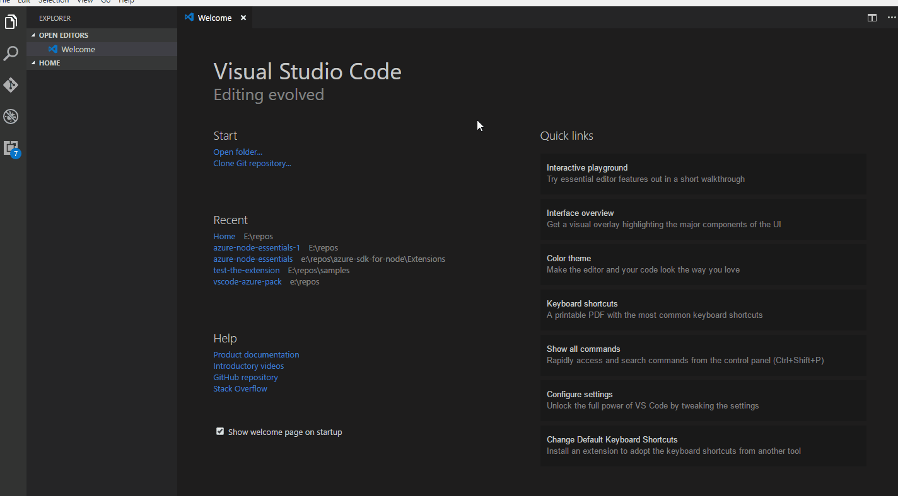
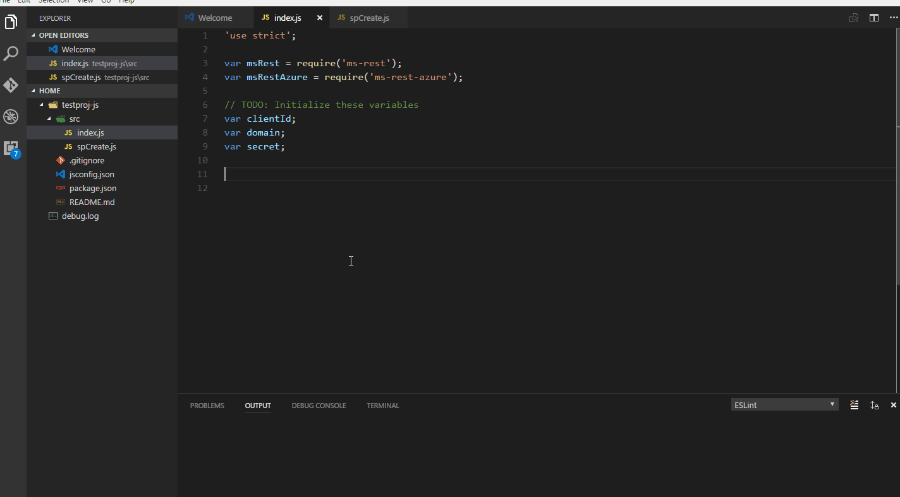
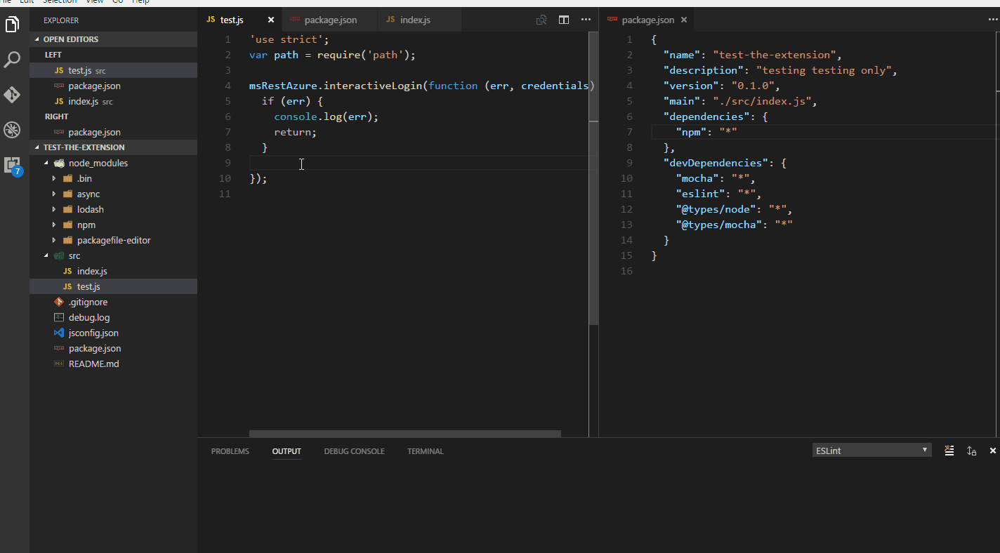

# Azure Node Essentials

This extension provides tools for NodeJs developers working with Azure SDKs.

## Feature List

1. Project and file scaffolding
   * `yo azure-node` to create
      * Javascript or Typescript project with package.json set up to target Azure SDKs
      * Empty .js or .ts files
      * pre populated .tsconfig or .jsconfig files
      * create a service principal
1. Snippets for some common operations such as authentication, creating a service principal.
   * `loginInt` : generate code for interactive login
   * `loginPwd` : generate code for logging in with username and password
   * `loginSp`  : generate code for logging in with a service principal
   * `spCreate` : generate code to create a service principal
1. Code generation scenarios
   * command `Azure-Node: Generate code for template deployment` : generate code for template deployment

## Demo

### Project Scaffolding

### Snippets

### Code generation

1. #### template deployment

### Sample workflow

1. Open VS code with an empty workspace (empty folder)
1. Bring up VS code command palette, invoke `yo`
1. Choose `azure-node` generator and invoke it.
1. Choose `* app` to invoke the main generator (the sub generators for files are listed at the root level)
1. Choose a Javascript project and proceed.
1. This should initialize your project and install npm dependencies
1. Meanwhile, open the folder in VSCode and navigate to index.js
1. Notice that package.json has been set up and index.js has boiler plate code for authentication.
1. Place caret on the line after `// TODO: Write your application logic here.`
1. From VS Code's command palette, invoke `>Azure-Node: Generate code for template deployment`
1. The extension generates code for template deployment in the file currently active in the vscode editor and adds required dependencies to package.json.

## Dependencies

The following package/extension dependencies are auto installed when you install this extension.

1. [vscode yo](https://marketplace.visualstudio.com/items?itemName=samverschueren.yo)
1. [generator-azure-node](https://github.com/Azure/generator-azure-node)

## Contributing

This project has adopted the [Microsoft Open Source Code of Conduct](https://opensource.microsoft.com/codeofconduct/). For more information see the [Code of Conduct FAQ](https://opensource.microsoft.com/codeofconduct/faq/) or contact [opencode@microsoft.com](mailto:opencode@microsoft.com) with any additional questions or comments.
